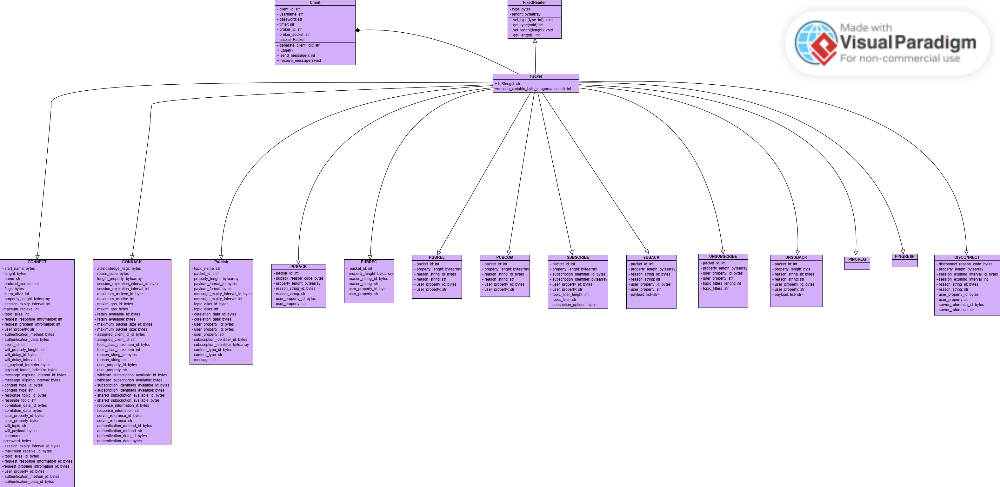

###### [<< Înapoi la cuprins](../Cuprins.md)
###### [< Thread-urile aplicației](02.%20Thread-urile%20aplicației.md)
# Diagrama de clase
### Pentru modelarea entităților din program: a clientului și a pachetelor prin intermediul căreia se realizează comunicarea cu broker-ul vom apela la paradigma orientată obiect. Astfel, vom avea o clasă pentru fiecare entitate din cadrul aplicației. Mai jos este prezentată diagrama de clase care descrie relațiile dintre entități.

###### [Clasa client >](04.%20Client.md)
