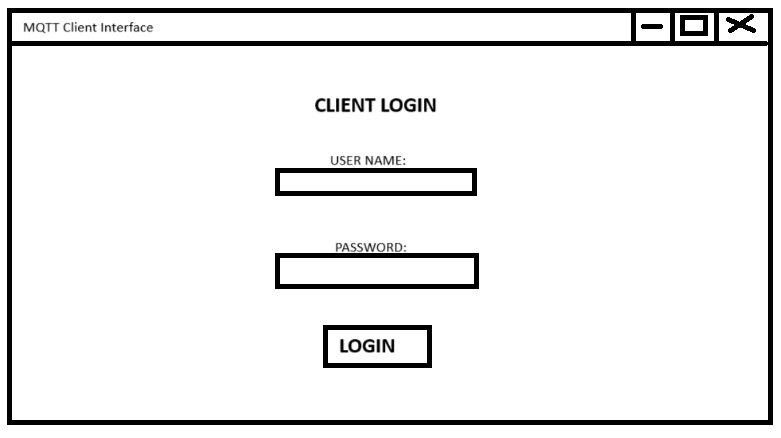
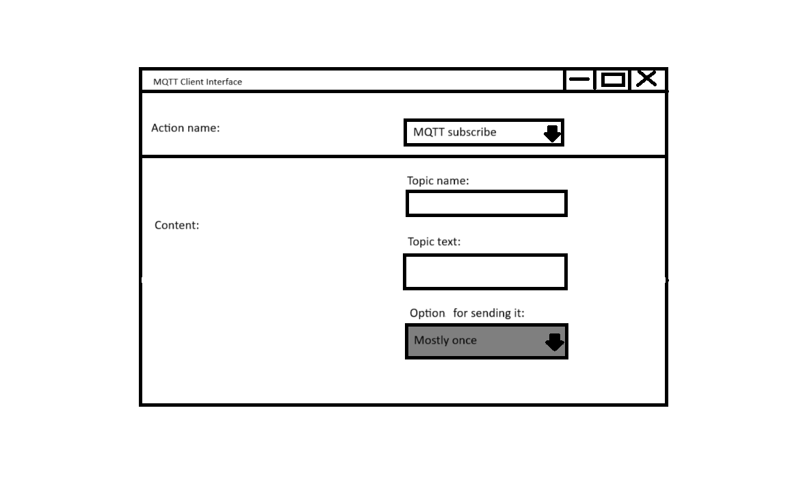

###### [<< Înapoi la cuprins](../Cuprins.md)
###### [< Implementare Socket](21.%20Implementare%20Socket)
# Interfața cu utilizatorul
### În acest subcapitol prezentăm o proiecție simplă a interfeței prin care clientul va comunica cu server-ul. Acțiunile principale pe care acesta le poate face sunt:
  - conectarea la server;
  - publicarea de mesaje într-un un topic pe care și-l poate alege;
  - abonarea la un topic din cele deja existente;
  - deconectarea.
### Înainte de orice altă acțiune, clientul este nevoit să se conecteze la server printr-un username și o parolă, care vor fi verificate pentru a menține un nivel sporit de securitate.

### Odată efectuată conectarea, clientul poate acum să trimită mesaje din diferite topicuri (MQTT Publish) și să se aboneze la un topic ales din cele deja existente (MQTT Subscribe).

- În primă fază, clientul poate alege opțiunea de a se abona sau de a publica. Dacă clientul decide că dorește să publice (MQTT Publish), opțiunile Topic Text și Send se vor activa, permițând completarea, respectiv alegerea opțiunii potrivite. Câmpul Send, având ca selecții "At most once", "At least once" și "Exactly once", implementează Quality of Service la nivelul pachetului Publish, care va fi trimis în urma solicitării de publicare a unui mesaj.
- Dacă clientul decide doar să se aboneze, va selecta "MQTT Subscribe", având la dispoziție câmpul "Topic name". Celelalte două câmpuri ilustrate nu vor fi disponibile, întrucât sunt specifice doar în cazul publicării unui mesaj.
###### [Capitolul 4 Anexe: 01. Bibliografie >](../Capitolul%204%20Anexe/01.%20Bibliografie.md)
